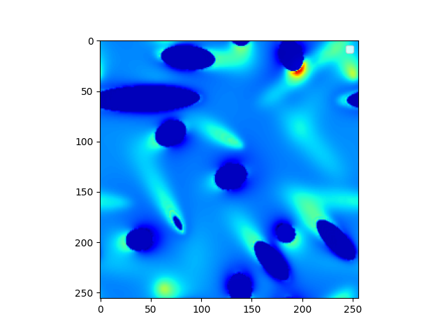
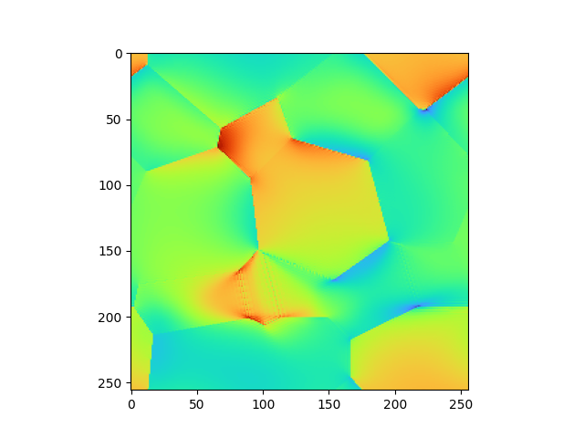

# FFTix

This repository contains some tools for FFT-based homogenization. The idea is to use numpy.fft and hence providing simple codes with a simple structure. 

utils.py : Utilities for manipulation of tensors (requires numba)

Operators.py : Green's operators and so on (requires numba)

Linear_schemes.py : well-known FFT-based iterative schemes for homogenization in mechanics (and thermics: coming soon).

Non_linear_schemes.py : algorithms for integration of a non linear behaviour (imposed macroscopic strain)

demos : folder with demos
 
 - linear_elasticity.py : simple examples for linear case
 - linear_viscoelasticity.py : example of a viscoelastic computation, using [MFront](https://thelfer.github.io/tfel/web/index.html) material behaviours on each phase. The file "maxwell.mfront" must be compiled with mfront by doing "mfront --obuild --interface=generic maxwell.mfront" and then, to launch the demo (but also to use Non_linear_schemes.py), the mgis module must be sourced. Hence, you must install [MFrontGenericInterfaceSupport](https://github.com/thelfer/MFrontGenericInterfaceSupport).
 - non_linear_polycrystal.py : example of a computation on a polycrystal, using a MFront material behaviour on each grain. The file "crystalline.mfront" must be compiled with mfront by doing "mfront --obuild --interface=generic crystalline.mfront" and then, to launch the demo (but also to use Non_linear_schemes.py), the mgis module must be sourced, like for previous example.

 ## Examples

 Here is an example with Linear_schemes.py, of a FFT computation in linear elasticity, with "Brisard-Dormieux" discretization of Green operator, on a 256^3 grid:

 

     
    <em> Reinforced medium, FFT computation</em>
 

 The microstructure was generated using [Generatix](https://github.com/Antoine2022/Generatix)

 Here is an example performed with the demo linear_viscoelasticity.py, of a FFT computation in linear visco-elasticity:

https://github.com/user-attachments/assets/674a64cb-4099-4709-9c54-2545897cdaf1

And another example on a polycrystal whose strain-rate is governed by one non-linear potential (demo non_linear_polycrystal.py):

     
    <em> Polycrystal, 10 grains, each with different sliding systems, resolved shear stress and creep exponents </em>
 

The microstructure was generated with [merope](https://github.com/MarcJos/Merope).

